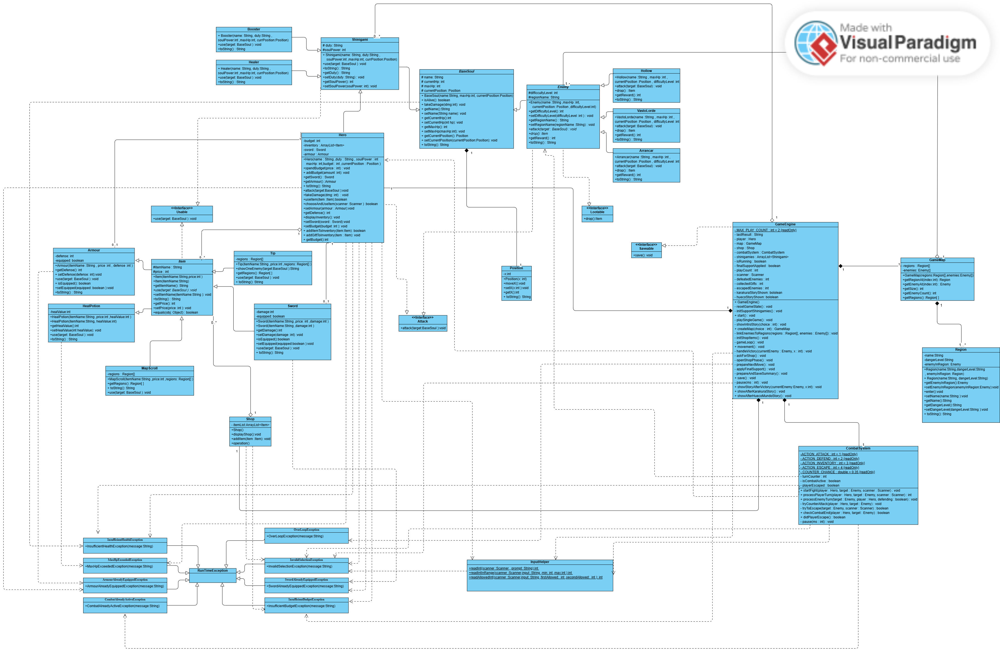

# SoulReaper ⚔️

A console-based, text-driven Object-Oriented Role-Playing Game (RPG) developed in Java. Inspired by supernatural anime lore, players take on the role of a guardian navigating through hostile zones to purify corrupted spirits and maintain the spiritual balance of the universe.

## 📄 Project Report & Architecture
For a deep dive into the game's architecture, design decisions, and OOP implementations, please read our comprehensive **[Project Report (PDF)](docs/SoulReaper_report.pdf)**. 

The report details our technical approaches, including:
* Inheritance and Abstract Class Frameworks (`BaseSoul`, `Enemy`, `Item`)
* Interface-Driven Architecture (`Attack`, `Usable`, `Lootable`, `Saveable`)
* Exception Handling Strategy (Custom exceptions like `OverLoopException`, `InsufficientBudgetException`, etc.)

## ✨ Key Features
* **Robust OOP Architecture:** Structured classes utilizing polymorphism, inheritance, and interfaces.
* **Dynamic Combat System:** Turn-based mechanics with damage calculation, counter-attacks, and support NPCs (Healer & Booster).
* **Inventory & Economy:** Consumable item logic, dynamic state updates, and an integrated Shop system.
* **Save System:** Generates end-game status reports of defeated enemies and collected items (Check the `examples/` folder for sample `.txt` save files).

## 🏗️ System Design (UML)
The system was designed to ensure maintainable class structures and effective distribution of responsibilities.



## 📚 Documentation (Javadoc)
Full technical documentation for all methods and classes has been generated using Javadoc. 
To view it, navigate to `docs/javadoc/index.html` in the repository and open it in any web browser.

## 🚀 How to Run
1. Clone the repository:
   ```bash
   git clone [https://github.com/AslanRunner/SoulReaper.git](https://github.com/AslanRunner/SoulReaper.git)
